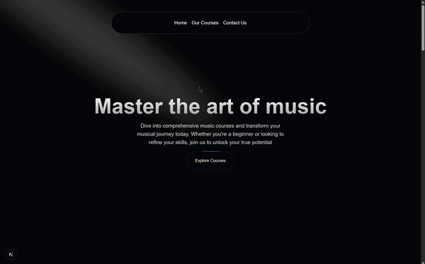

# 🎵 MusicNextJS

 

MusicNextJS is a highly interactive, visually stunning frontend web application built for a music academy. It leverages the power of Next.js 16 (App Router) and features smooth, modern animations using Aceternity UI and Framer Motion.

## 🚀 Tech Stack

* **Framework:** [Next.js](https://nextjs.org/) (v16.2)
* **Library:** [React](https://react.dev/) (v19)
* **Styling:** [Tailwind CSS](https://tailwindcss.com/) (v4)
* **Animations:** Motion (Framer Motion)
* **UI Components:** [Aceternity UI](https://ui.aceternity.com/)

## ✨ Aceternity UI Components Used

This project makes extensive use of Aceternity UI to create a dynamic user experience. The following components are integrated into the `src/components/ui` directory:

* **3D Card (`3d-card.tsx`)**: For immersive, interactive course displays.
* **Animated Tooltip (`animated-tooltip.tsx`)**: Used for displaying instructor profiles interactively.
* **Background Beams (`background-beams.tsx`)**: Adds a sleek, modern animated background.
* **Card Hover Effect (`card-hover-effect.tsx`)**: Highlights features or courses when a user hovers over them.
* **Infinite Moving Cards (`infinite-moving-cards.tsx`)**: Perfect for showcasing testimonials continuously.
* **Moving Border (`moving-border.tsx`)**: Adds a glowing, moving border to buttons or important cards.
* **Navbar Menu (`navbar-menu.tsx`)**: A sleek dropdown navigation menu.
* **Spotlight (`Spotlight.tsx`)**: Creates a dramatic lighting effect, likely used in the Hero Section.
* **Sticky Scroll Reveal (`sticky-scroll-reveal.tsx`)**: Reveals content smoothly as the user scrolls down.
* **Wavy Background (`wavy-background.tsx`)**: A fluid, wave-like animated background for specific sections.

## 📂 Project Structure

* `/public/courses/` - Contains all static image assets for the music courses.
* `/src/app/` - Next.js App Router containing the main pages (`page.tsx`, `layout.tsx`, `/contact`, `/courses`).
* `/src/components/ui/` - Reusable animated Aceternity UI components.
* `/src/components/` - Main structural components (`HeroSection`, `FeaturedCourses`, `Instructors`, `WhyChooseUs`, etc.).
* `/src/data/` - Contains local JSON data (`music_courses.json`) to populate the frontend.

## 🛠️ Getting Started

First, clone the repository and install the dependencies:

```bash
npm install
```

Then, run the development server:

```bash
npm run dev
```

Open http://localhost:3000 with your browser to see the result.
